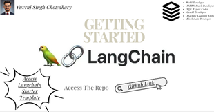
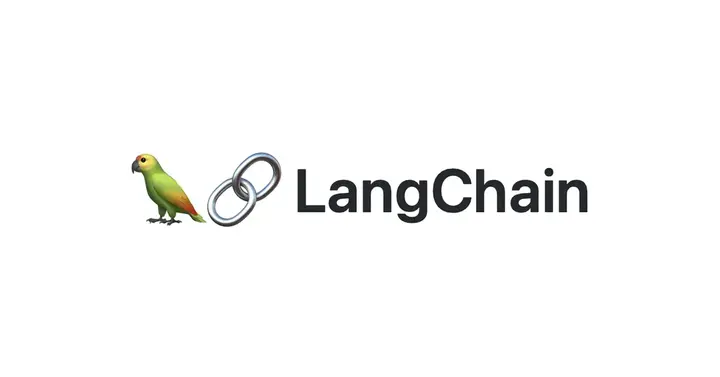

Welcome to the Starter Langchain Template! This project template, created by Yuvraj Singh Chowdhary, is designed to help developers harness the power of advanced language models and tools from LangChain. Whether you are a Web3 Developer, MERN Stack Developer, or belong to any domain, this template is tailored for you to explore AI applications effortlessly.

## Tech Stack


## Overview

This template integrates tools like Wikipedia, LLM-Math, and more to enable dynamic content generation. You can easily query Wikipedia, generate product descriptions, and create sequential chains of content. It's an ideal starting point for enhancing productivity and exploring various AI applications.

## Features

- **Wikipedia Query**: Fetch and utilize information directly from Wikipedia.
- **Product Description Generation**: Create compelling product descriptions based on given details.
- **Sequential Chains**: Generate sequences of content, such as synopses and reviews.
- **Memory Usage**: Implement conversation buffer memory to maintain context.

## Why This Template?

As a developer in the AI and tech industry, I created this template to provide an easy-to-use, powerful tool for generating dynamic content. My goal is to empower developers to innovate and enhance their productivity using AI-driven solutions.

## Installation

To get started, you need to install the following dependencies:

```bash
pip install anthropic
pip install langchain
pip install langchain-core
pip install wikipedia-api
pip install numpy
pip install openai
pip install python-dotenv
pip install wikipedia
pip install llmmath
pip install numexpr
```

## Usage

Follow these steps to utilize the template:

1. Clone this repository to your local machine.
2. Install the necessary dependencies using the above commands.
3. Set up your environment variables by creating a `.env` file and adding your API key:
   ```env
   ANTHROPIC_API_KEY=your_api_key_here
   ```
4. Run the main script to see the template in action:
   ```python
   python main.py
   ```

## Recommended Platform

For the best experience, use this template on [Replit](https://replit.com/). Replit offers an excellent environment for running and testing this project.



## Developer Information

**Yuvraj Singh Chowdhary**

- LinkedIn: [Yuvraj Singh Chowdhary](https://www.linkedin.com/in/yuvraj-singh-chowdhary/)
- Reddit: [SuccessfulStrain9533](https://www.reddit.com/user/SuccessfulStrain9533/)


**About Me**:
Web3 Developer | MERN Stack Developer | SQL Expert | Coder | GenAI Developer | Machine Learning Enthusiast | Blockchain Developer | Web Analyst

## References

- [LangChain Documentation](https://python.langchain.com/v0.1/docs/get_started/introduction/)

## Developer Info


- **LinkedIn**: [Connect with me on LinkedIn](https://www.linkedin.com/in/yuvraj-singh-chowdhary/)
- **Reddit**: [Follow me on Reddit](https://www.reddit.com/user/chowdhary19)
- **GitHub Repo**: [GitHub Repository](https://github.com/chowdhary19/Langchain_Tut.git)


---

I hope this template helps you unlock new potentials in AI-driven content generation. Happy coding!

